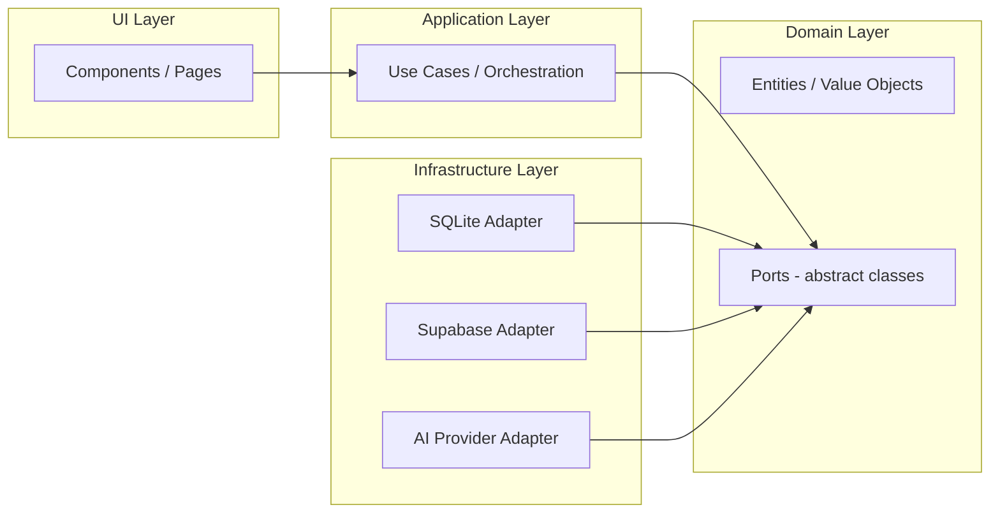

# ADR-013: Hexagonal Architecture (Ports and Adapters) per Context

## Status

Accepted

## Context

The codebase needs an architectural pattern that:
- Keeps business logic isolated from UI and infrastructure.
- Allows swapping storage backends (SQLite ↔ Supabase) without touching business rules.
- Scales cleanly per feature without creating a monolithic wiring file.
- Makes testing straightforward with real implementations, not mocks.

Per-context organization (ADR-010) handles isolation. The question is: what goes INSIDE each context?

## Decision

Each context follows **hexagonal architecture** (also known as **ports and adapters**):



### Layers

| Layer | Responsibility | Depends on |
|-------|---------------|------------|
| **Domain** | Business rules, entities, value objects, ports (abstract classes) | Nothing (dependency root) |
| **Application** | Use cases, orchestration. Coordinates domain and ports. | Domain only |
| **Infrastructure** | Concrete adapters. Implements domain ports. | Domain (implements ports) |
| **UI** | Components, pages, forms. User interaction. | Application (calls use cases) |

### Dependency Rule

Dependencies flow **inward** toward Domain:

```
UI → Application → Domain ← Infrastructure
```

- Domain **never** imports from Application, Infrastructure, or UI.
- Application **only** imports Domain types and ports.
- Infrastructure **implements** Domain ports (via `implements`, not `extends` per ADR-011).
- UI **calls** Application use cases. No business logic in UI.

### Ports and Adapters

- **Port**: an abstract class in `domain/ports/` defining a contract (e.g., `WorkoutRepository`, `AuthPort`).
- **Adapter**: a concrete class in `infrastructure/` that implements a port (e.g., `SqliteWorkoutRepository`, `SupabaseAuthAdapter`).
- **Composition**: a per-context file (`[context].composition.ts`) that wires the correct adapter based on `STORAGE_BACKEND`. Per ADR-010.

### File Structure per Context

```
src/lib/contexts/<context>/
  <context>.composition.ts        ← wires adapters (the single place for this context)
  domain/
    <context>.types.ts            ← TypeScript interfaces
    <context>.constants.ts        ← enums, rules, constraints
    entities/                     ← domain objects with identity
    ports/                        ← abstract classes (contracts)
  application/
    *.use-case.ts                 ← one file per use case
  infrastructure/
    supabase/                     ← Supabase adapters (production)
    sqlite/                       ← SQLite adapters (dev/tests)
    [ai|storage|...]/             ← other adapter categories as needed
  ui/
    *.svelte | *.tsx | *.astro   ← context-specific components
```

## Rationale

- **Isolation**: each context is a self-contained module. Changes in one context don't ripple.
- **Testability**: use cases are tested with SQLite adapters (real SQL, no network). No mocks needed (ADR-009).
- **Swappability**: storage backend changes only affect `infrastructure/` and `composition.ts`. Domain and Application untouched.
- **Scalability**: new features add a new context folder. No central container grows unbounded.
- **Clarity**: anyone reading the codebase sees the pattern at a glance — domain at the center, adapters at the edge.

## Trade-offs

- **Pro**: business logic is portable across any storage backend.
- **Pro**: tests run fast against SQLite with real implementations.
- **Pro**: new adapters (e.g., in-memory for unit tests) are trivial to add.
- **Con**: more boilerplate per context (abstract class + two implementations).
- **Con**: schema changes must update both SQLite and Supabase adapters.

## Consequences

- Every context follows the 4-layer structure: Domain → Application → Infrastructure → UI.
- Domain ports are **abstract classes** (not interfaces, per ADR-007).
- Concrete adapters use **`implements`** (not `extends`, per ADR-011).
- Per-context composition files wire adapters based on `STORAGE_BACKEND` (per ADR-010).
- Tests use SQLite adapters + Object Mothers (per ADR-009). No mocks.
- This ADR is the single source of truth for the architectural pattern. All context readmes reference it.

## Related ADRs

- [ADR-007](./007-repository-pattern.md) — Repository pattern (abstract class + dual impls)
- [ADR-008](./008-key-value-storage.md) — KeyValueStorage abstraction
- [ADR-010](./010-per-context-composition.md) — Per-context composition files
- [ADR-011](./011-implements-not-extends.md) — `implements` not `extends`
- [ADR-012](./012-drizzle-orm.md) — Drizzle ORM as SQLite/Postgres abstraction
