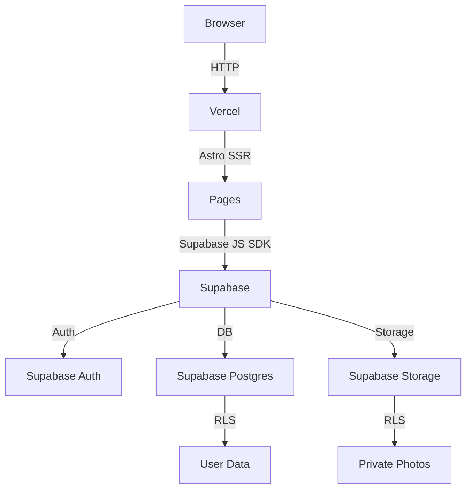

# System Architecture

Parent: [./readme.md](./readme.md) · Up: [../README.md](../README.md)

## Topology



## Rendering Strategy

| Page | Mode | Reason |
|------|------|--------|
| Landing (`/`) | Static | No dynamic data, fast load |
| Login/Register | Static | Forms only |
| Dashboard (`/dashboard`) | SSR | Today's workout, user-specific |
| Workout (`/workout/[id]`) | SSR | Dynamic exercise logging |
| History (`/history`) | SSR | User-specific workout list |
| Progress (`/progress`) | SSR | Charts from user data |
| Photos (`/photos`) | SSR | Private photo gallery |
| Family (`/family`) | SSR | Multi-user data |
| Settings (`/settings`) | SSR | User profile/settings |

Astro in SSR mode with `@astrojs/vercel` adapter. Per [ADR-001](./decisions/001-supabase-client-side.md).

## Tech Stack

| Layer | Choice | Decision |
|-------|--------|----------|
| Language | TypeScript 7 | — |
| Frontend | Astro (SSR + islands) | — |
| Backend/DB | Supabase (Postgres, Auth, Storage, RLS) | [ADR-001](./decisions/001-supabase-client-side.md) |
| Hosting | Vercel | — |
| Auth | Supabase Auth (email/password) | — |
| Charts | Chart.js via React island | [ADR-002](./decisions/002-chartjs-react-island.md) |
| Storage | Supabase Storage (progress photos) | [ADR-005](./decisions/005-private-photos.md) |
| Test data | @faker-js/faker + Object Mothers | [ADR-009](./decisions/009-object-mothers.md) |

## Project Structure

File naming: **kebab-case** throughout. All TypeScript files in domain layer use `[context].types.ts`, `[context].constants.ts`, etc.

```
gym-up/
├── src/
│   ├── pages/
│   │   ├── index.astro
│   │   ├── login.astro
│   │   ├── register.astro
│   │   ├── dashboard.astro
│   │   ├── workout/[id].astro
│   │   ├── history.astro
│   │   ├── progress.astro
│   │   ├── photos.astro
│   │   ├── family.astro
│   │   └── settings.astro
│   ├── components/
│   │   ├── exercise-card.astro
│   │   ├── workout-summary.astro
│   │   ├── rest-timer.svelte             ← Svelte islands for interactive
│   │   ├── progress-chart.tsx            ← React island for charts
│   │   ├── photo-gallery.svelte
│   │   ├── photo-upload.svelte
│   │   ├── family-member-card.svelte
│   │   └── navigation.astro
│   ├── lib/
│   │   ├── supabase.ts
│   │   ├── sqlite.ts
│   │   ├── config.ts                    ← useSupabase, supabaseClient, sqliteDb
│   │   ├── storage/                     ← Shared storage abstractions
│   │   │   ├── key-value.storage.ts      ← abstract KeyValueStorage class
│   │   │   ├── browser-key-value.storage.ts
│   │   │   └── sqlite-key-value.storage.ts
│   │   └── contexts/                     ← per-context composition (ADR-010)
│   │       ├── auth/
│   │       │   ├── auth.composition.ts
│   │       │   ├── domain/
│   │       │   │   ├── auth.types.ts          ← types for auth context
│   │       │   │   ├── auth.constants.ts      ← enums as const + derived types
│   │       │   │   ├── entities/
│   │       │   │   │   └── session.entity.ts
│   │       │   │   └── ports/
│   │       │   │       ├── auth-port.ts        ← abstract class
│   │       │   │       └── session-port.ts
│   │       │   ├── application/
│   │       │   │   ├── register-user.use-case.ts
│   │       │   │   ├── login-user.use-case.ts
│   │       │   │   └── logout-user.use-case.ts
│   │       │   ├── infrastructure/
│   │       │   │   ├── supabase/
│   │       │   │   │   ├── supabase-auth.adapter.ts
│   │       │   │   │   └── supabase-session.adapter.ts
│   │       │   │   └── sqlite/
│   │       │   │       ├── sqlite-auth.adapter.ts
│   │       │   │       └── sqlite-session.adapter.ts
│   │       │   └── ui/
│   │       │       └── auth-form.svelte
│   │       ├── user/
│   │       │   ├── user.composition.ts
│   │       │   ├── domain/
│   │       │   │   ├── user.types.ts
│   │       │   │   ├── user.constants.ts
│   │       │   │   ├── entities/
│   │       │   │   │   └── profile.entity.ts
│   │       │   │   └── ports/
│   │       │   │       ├── profile-repository.ts
│   │       │   │       └── nutrition-goal-repository.ts
│   │       │   ├── application/
│   │       │   │   ├── get-profile.use-case.ts
│   │       │   │   ├── update-display-name.use-case.ts
│   │       │   │   ├── update-routine-type.use-case.ts
│   │       │   │   ├── update-weight-unit.use-case.ts
│   │       │   │   └── set-calorie-goal.use-case.ts
│   │       │   ├── infrastructure/
│   │       │   │   ├── supabase/
│   │       │   │   │   ├── supabase-profile.repository.ts
│   │       │   │   │   └── supabase-nutrition-goal.repository.ts
│   │       │   │   └── sqlite/
│   │       │   │       ├── sqlite-profile.repository.ts
│   │       │   │       └── sqlite-nutrition-goal.repository.ts
│   │       │   └── ui/
│   │       │       └── settings-form.svelte
│   │       ├── workout-tracking/
│   │       │   ├── workout-tracking.composition.ts
│   │       │   ├── domain/
│   │       │   │   ├── workout-tracking.types.ts
│   │       │   │   ├── workout-tracking.constants.ts
│   │       │   │   ├── entities/
│   │       │   │   │   ├── workout.entity.ts
│   │       │   │   │   ├── workout-entry.entity.ts
│   │       │   │   │   ├── routine.entity.ts
│   │       │   │   │   ├── routine-day.entity.ts
│   │       │   │   │   ├── routine-exercise.entity.ts
│   │       │   │   │   └── exercise.entity.ts
│   │       │   │   └── ports/
│   │       │   │       ├── workout-repository.ts
│   │       │   │       ├── workout-entry-repository.ts
│   │       │   │       ├── routine-repository.ts
│   │       │   │       └── exercise-repository.ts
│   │       │   ├── application/
│   │       │   │   ├── get-today-workout.use-case.ts
│   │       │   │   ├── start-workout.use-case.ts
│   │       │   │   ├── resume-workout.use-case.ts
│   │       │   │   ├── log-set.use-case.ts
│   │       │   │   ├── complete-workout.use-case.ts
│   │       │   │   └── get-workout-history.use-case.ts
│   │       │   ├── infrastructure/
│   │       │   │   ├── supabase/
│   │       │   │   └── sqlite/
│   │       │   └── ui/
│   │       │       ├── exercise-card.svelte
│   │       │       ├── rest-timer.svelte
│   │       │       └── workout-summary.svelte
│   │       ├── progress/
│   │       ├── public-view/
│   │       ├── private-photos/
│   │       └── nutrition/
│   ├── test/                            ← NO MOCKS (ADR-009)
│   │   ├── setup.ts                     ← createTestDb() helper
│   │   └── mothers/                     ← Object Mothers with @faker-js/faker
│   │       ├── profile.mother.ts
│   │       ├── workout.mother.ts
│   │       ├── workout-entry.mother.ts
│   │       ├── progress-photo.mother.ts
│   │       ├── nutrition-entry.mother.ts
│   │       └── routine.mother.ts
│   ├── types/
│   │   └── index.ts
│   └── layouts/
│       └── layout.astro
├── supabase/
│   └── migrations/
│       └── 001_initial_schema.sql
└── public/
```

## File Naming Conventions

| File type | Pattern | Example |
|-----------|---------|---------|
| Context composition | `[context].composition.ts` | `auth.composition.ts` |
| Context types | `[context].types.ts` | `auth.types.ts` |
| Context constants | `[context].constants.ts` | `auth.constants.ts` |
| Entity | `[name].entity.ts` | `workout.entity.ts` |
| Port (abstract class) | `[name]-port.ts` or `[name]-repository.ts` | `workout-repository.ts` |
| Use case | `[verb-noun].use-case.ts` | `start-workout.use-case.ts` |
| Repository impl | `[storage]-[entity].repository.ts` | `supabase-workout.repository.ts` |
| Adapter impl | `[storage]-[port].adapter.ts` | `supabase-auth.adapter.ts` |
| UI component | `[name].svelte` or `[name].tsx` | `rest-timer.svelte` |
| Test mother | `[entity].mother.ts` | `workout.mother.ts` |
| Object Mother file (kebab-case) | `[entity].mother.ts` | `workout.mother.ts` |
| Flow file | `[name].flow.md` | `start-workout.flow.md` |

All file names use **kebab-case** (lowercase with hyphens). No camelCase or PascalCase in filenames.

## Constants Pattern

All enums in TypeScript use the `as const` + derived type pattern:

```ts
// auth.constants.ts
export const AuthEvents = {
  SignedIn: 'SIGNED_IN',
  SignedOut: 'SIGNED_OUT',
  TokenRefreshed: 'TOKEN_REFRESHED',
} as const;

export type AuthEvent = (typeof AuthEvents)[keyof typeof AuthEvents];

// workout-tracking.constants.ts
export const WorkoutStatuses = {
  InProgress: 'in_progress',
  Completed: 'completed',
} as const;

export type WorkoutStatus = (typeof WorkoutStatuses)[keyof typeof WorkoutStatuses];

// user.constants.ts
export const RoutineTypes = {
  Hombre: 'hombre',
  Mujer: 'mujer',
} as const;
export type RoutineType = (typeof RoutineTypes)[keyof typeof RoutineTypes];

export const WeightUnits = {
  Kg: 'kg',
  Lbs: 'lbs',
} as const;
export type WeightUnit = (typeof WeightUnits)[keyof typeof WeightUnits];
```

**Why this pattern**:
- Runtime values preserved (can iterate, use in switch)
- TypeScript can derive literal types from `as const`
- Type and value are linked — change one, both update
- No magic strings — IDE autocomplete works
- Per-context constants file per [ADR-009](./decisions/009-object-mothers.md) naming convention

## Repository Pattern

Per [ADR-007](./decisions/007-repository-pattern.md), every entity has:
- An **abstract class** defining the contract
- A **Supabase** implementation (production)
- A **SQLite** implementation (tests, e2e)

Use cases depend on the abstract class. No mocks — only real implementations with test data via Object Mothers. Per [ADR-009](./decisions/009-object-mothers.md).

## Per-Context Composition

Per [ADR-010](./decisions/010-per-context-composition.md), each context has its own composition file. No central root.

```ts
// src/lib/contexts/workout-tracking/workout-tracking.composition.ts
import { useSupabase, supabaseClient, sqliteDb } from '@/lib/config';
import { SupabaseWorkoutRepository } from './infrastructure/supabase/SupabaseWorkoutRepository';
import { SqliteWorkoutRepository } from './infrastructure/sqlite/SqliteWorkoutRepository';
import { StartWorkoutUseCase } from './application/StartWorkoutUseCase';

const workoutRepo: WorkoutRepository = useSupabase
  ? new SupabaseWorkoutRepository(supabaseClient)
  : new SqliteWorkoutRepository(sqliteDb);

export const startWorkoutUseCase = new StartWorkoutUseCase(workoutRepo);
```

```ts
// src/pages/dashboard.astro
---
import { startWorkoutUseCase } from '@/lib/contexts/workout-tracking/workout-tracking.composition';
const today = await startWorkoutUseCase.getToday(userId);
---
```

### Implementation per entity

| Entity | Abstract class | Supabase impl | SQLite impl |
|--------|----------------|---------------|-------------|
| Profile | `ProfileRepository` | `SupabaseProfileRepository` | `SqliteProfileRepository` |
| Workout | `WorkoutRepository` | `SupabaseWorkoutRepository` | `SqliteWorkoutRepository` |
| WorkoutEntry | `WorkoutEntryRepository` | `SupabaseWorkoutEntryRepository` | `SqliteWorkoutEntryRepository` |
| Routine | `RoutineRepository` | `SupabaseRoutineRepository` | `SqliteRoutineRepository` |
| Exercise | `ExerciseRepository` | `SupabaseExerciseRepository` | `SqliteExerciseRepository` |
| Photo | `PhotoRepository` | `SupabasePhotoRepository` | `SqlitePhotoRepository` |
| PhotoStorage | `PhotoStorageAdapter` | `SupabasePhotoStorageAdapter` | `LocalPhotoStorageAdapter` |
| NutritionEntry | `NutritionEntryRepository` | `SupabaseNutritionEntryRepository` | `SqliteNutritionEntryRepository` |
| NutritionGoal | `NutritionGoalRepository` | `SupabaseNutritionGoalRepository` | `SqliteNutritionGoalRepository` |
| KeyValue | `KeyValueStorage` | `BrowserKeyValueStorage` | `SqliteKeyValueStorage` |

## KeyValueStorage

Per [ADR-008](./decisions/008-key-value-storage.md), ephemeral state (drafts, timer, UI prefs) uses `KeyValueStorage` abstract class. Browser uses `window.localStorage`, tests use SQLite `key_value` table.

```ts
// src/lib/storage/key-value.storage.ts
abstract class KeyValueStorage {
  abstract get<T>(key: string): T | null;
  abstract set<T>(key: string, value: T): void;
  abstract delete(key: string): void;
  abstract has(key: string): boolean;
  abstract clear(): void;
}
```

## Test Pattern

Per [ADR-009](./decisions/009-object-mothers.md), tests use Object Mothers with `@faker-js/faker`. **NO MOCKS** — only fakes (real implementations).

```ts
// src/test/contexts/workout-tracking/StartWorkoutUseCase.test.ts
import { faker } from '@faker-js/faker';
import { WorkoutMother } from '@/test/mothers/WorkoutMother';
import { createTestDb } from '@/test/setup';

beforeEach(() => {
  const db = createTestDb(); // fresh in-memory SQLite
  // wire real SqliteXxxRepository — no mocks
});

it('creates workout', async () => {
  const userId = faker.string.uuid(); // realistic data, not 'user-1'
  const routineDayId = faker.string.uuid();
  // ... test with real SQLite
});
```

## Cross-Context Health & Safety Invariants

Rules that span multiple contexts. Enforced at composition/wiring level.

```ts
// src/lib/health-safety/health-safety.constants.ts

export const HealthRules = {
  // Sleep & recovery (cross-cuts workout + nutrition)
  MinSleepHours: 6,
  RecommendedSleepHours: 8,
  MaxSleepHours: 12,

  // Rest day rules
  MinRestDaysPerWeek: 1,
  MaxConsecutiveTrainingDays: 4,

  // Heart rate safety (workout context)
  MaxRecommendedHeartRate: 220 - 18,    // age 18 sample
  RestingHeartRateMax: 100,
  MinWorkoutHeartRate: 50,

  // Progression safety
  MaxWeightIncreasePerWeekPercent: 10,  // 10% per week (5/3/1 rule)
  MaxWeightIncreasePerSessionKg: 5,    // 5kg jump per session upper bound

  // Volume safety
  MaxWeeklyVolumeIncreasePercent: 10,
  MaxSetsPerMusclePerWeek: 20,

  // Joint recovery
  MinHoursBetweenSameMuscleGroup: 48,   // 2 days between same muscle
} as const;
```

### Invariants (cross-context)

#### Sleep & recovery
- User SHOULD sleep [`HealthRules.MinSleepHours`, `HealthRules.RecommendedSleepHours`] = [6, 8] hours per night.
- User CANNOT train more than `HealthRules.MaxConsecutiveTrainingDays` (4) days without rest day.
- User MUST have ≥ `HealthRules.MinRestDaysPerWeek` (1) rest day per week.

#### Heart rate safety (workout)
- User workout heart rate SHOULD be < `HealthRules.MaxRecommendedHeartRate` (220 - age).
- User resting heart rate SHOULD be < `HealthRules.RestingHeartRateMax` (100) bpm.

#### Progressive overload safety
- Weekly weight increase per lift MUST NOT exceed `HealthRules.MaxWeightIncreasePerWeekPercent` (10%).
- Per-session weight increase MUST NOT exceed `HealthRules.MaxWeightIncreasePerSessionKg` (5kg).
- Weekly training volume increase MUST NOT exceed `HealthRules.MaxWeeklyVolumeIncreasePercent` (10%).
- Min `HealthRules.MinHoursBetweenSameMuscleGroup` (48) hours between training same muscle.

#### Cross-context enforcement points
- `startWorkout.use-case.ts` checks consecutive training days.
- `log-set.use-case.ts` checks weight increase vs previous session.
- `nutrition-entries` POST handler checks junk food ratio (separate from workout).

---

## Interactive Components — Astro Islands

Per [ADR-002](./decisions/002-chartjs-react-island.md), interactive components are **Astro islands** — rendered with React or Svelte, hydrated only when needed. Astro is the framework, islands are the interaction layer.

### When to use each

| Framework | Use for |
|-----------|---------|
| **React** | Charts (Chart.js), forms with complex state, rich interactions |
| **Svelte** | Lightweight components, simple interactivity, less JS payload |
| **Astro** | Static layouts, SSR pages, non-interactive content |

### Example: Rest Timer (Svelte)

```astro
---
// src/components/rest-timer.astro
import RestTimerSvelte from './rest-timer.svelte';
---
<RestTimerSvelte client:visible defaultSeconds={90} />
```

### Example: Progress Chart (React)

```astro
---
// src/components/progress-chart.astro
import ProgressChartReact from './progress-chart.tsx';
---
<ProgressChartReact client:visible data={chartData} type="weight" />
```

## Deployment

**Full guide:** [../deployment/vercel.md](../deployment/vercel.md) (TODO)

- Astro with `@astrojs/vercel` adapter
- Dev / local: `STORAGE_BACKEND=sqlite` (no external services needed)
- Prod: `STORAGE_BACKEND=supabase` with `SUPABASE_URL`, `SUPABASE_ANON_KEY`
- Supabase free tier (500MB DB, 1GB storage)
