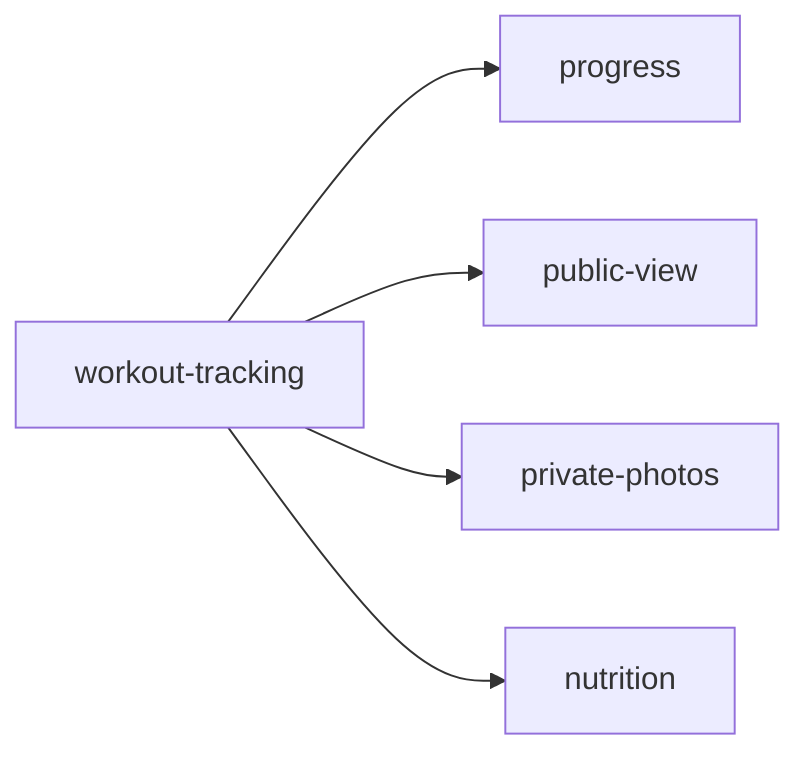

# Features — Index

Parent: [../readme.md](../readme.md) · Up: [../../README.md](../../README.md)

## Architecture Links

- System architecture: [architecture/system.md](../../architecture/system.md)
- Database schema: [architecture/database-schema.md](../../architecture/database-schema.md)
- Components: [architecture/components.md](../../architecture/components.md)
- Decisions: [architecture/decisions/readme.md](../../architecture/decisions/readme.md)

One feature per file. Cross-references are mandatory — features link to [architecture/](../../architecture/) and [../../planning/](../../planning/) rather than restating content.

Requirement IDs are indexed in [requirements-index.md](./requirements-index.md). Feature files remain the canonical source for requirement text.

## Files in this section

| File | Description |
|------|-------------|
| [workout-tracking.md](./workout-tracking.md) | Core workout loop: register, daily workout, log, complete |
| [progress.md](./progress.md) | Charts, history, streaks, calendar |
| [public-view.md](./public-view.md) | Family visibility: see siblings' stats (read-only) |
| [private-photos.md](./private-photos.md) | Owner-only progress photos |
| [nutrition.md](./nutrition.md) | Photo → AI → calorie estimation |
| [requirements-index.md](./requirements-index.md) | FR/NFR ID registry |

## Dependencies

`workout-tracking` is the foundation. All other features depend on it. `nutrition` is independent of workout tracking but shares the same user context.

## Cross-cutting concerns

- **RLS policies** are described in each feature's "Data" subsection — but the **SQL** lives in [database-schema.md](../../architecture/database-schema.md).
- **Components** are described in each feature — but the **full spec** lives in [components.md](../../architecture/components.md).
- **Open questions** that block any feature are tracked in [../../planning/open-questions.md](../../planning/open-questions.md).
